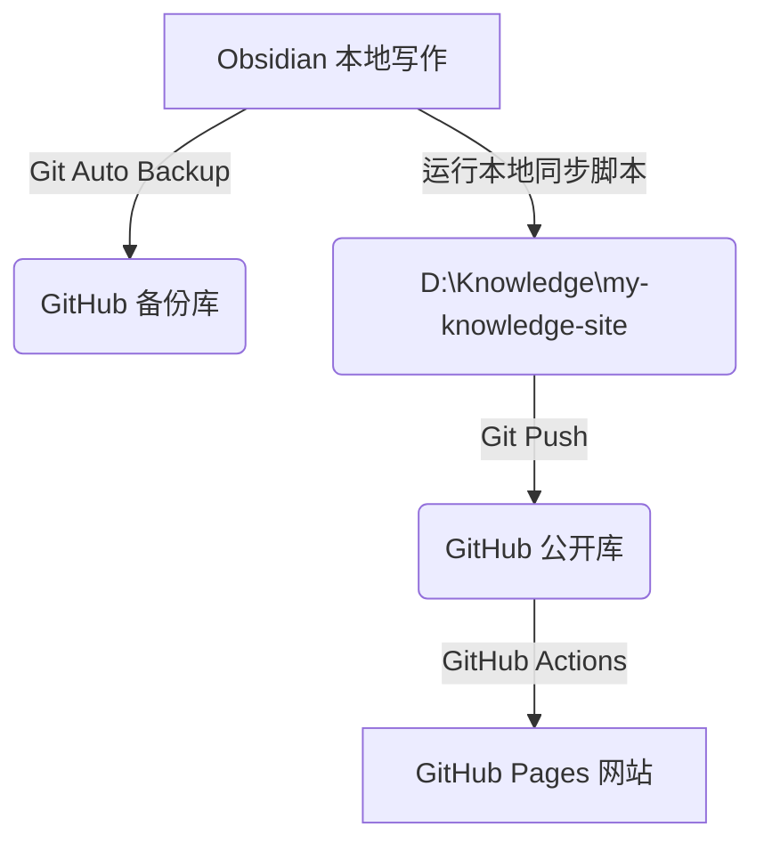

# 🌐 欢迎来到我的技术知识库

你好！这是一篇存放在 `public-notes` 目录下的**公开测试笔记**。

## 🚀 系统介绍
本知识库系统是基于以下方案构建的：
1. **Obsidian**：本地 Markdown 编辑器。
2. **GitHub 备份仓库**：个人备份仓库，保存我所有的完整笔记与个人记录。
3. **Quartz**：超快、超轻量的静态网站生成器，负责渲染公开笔记。
4. **GitHub Pages**：免费的静态网页托管平台。

## 🔗 双链与标签测试
*   这是一个内部标签测试：#welcome #guide
*   在 Obsidian 中，我可以像这样引用其他公开笔记：[[关于我]]（稍后创建）。
*   在 Quartz 中，这些双链将被自动转换为超链接，并且支持悬浮预览和反向链接！

## 💻 代码块高亮测试
下面是一段简单的 JavaScript 代码块，用于测试 Quartz 的代码高亮功能：

```javascript
// 打印欢迎信息
function sayHello(name) {
    console.log(`Hello, welcome to my knowledge base, ${name}!`);
}
sayHello("周鹏飞");
```

## 📊 Mermaid 图表测试

